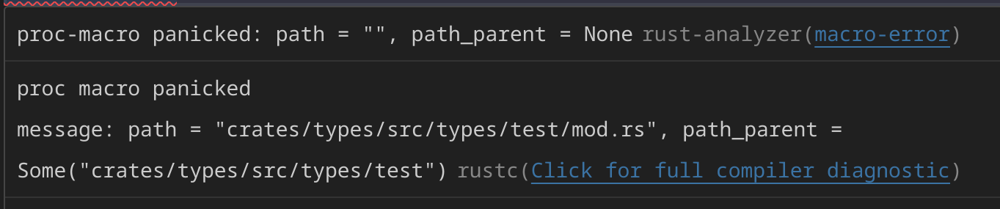

Hello, this is a repository dedicated to showing a difference in result between nightly rust and rust-analyzer

Below is a screenshot on my end, I've had no issue reproducting the issue on my personal machine (Fedora Linux) running `rustc 1.80.0-nightly (9c9b56879 2024-05-05)` and on my work machine (Windows 11). Running `rustc -V 1.78.0 (9b00956e5 2024-04-29)`. 

Which has panic messages generated by [this code](./crates/gen_test_eg/src/lib.rs#L7-L17).

---

If you would like anything extra or some more context or anything, feel free to contact me on [Discord (d3rpp)](https://discord.com/users/391039449863290880). Would be happy to help any way I can.